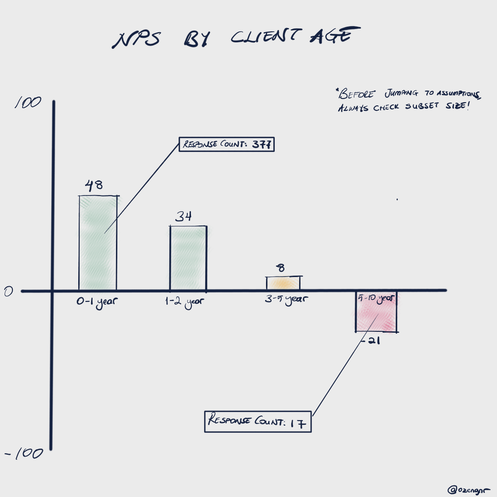
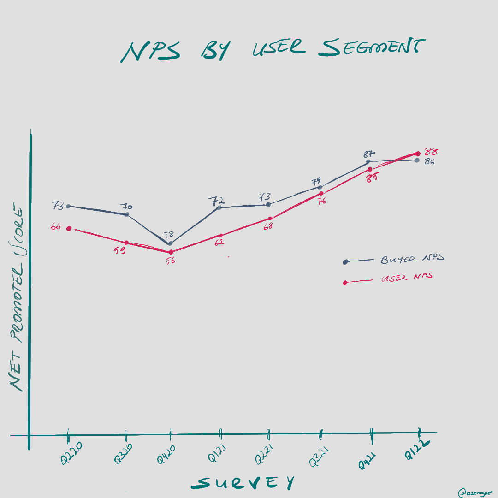

*This is a slightly altered version of my article that originally appeared on February 11, 2022 on my [Medium page.](https://medium.com/@ozengnr/net-promoter-score-part-2-impactful-metrics-bec56644a6c)*

An NPS survey is only as impactful as the actions your team takes on them. I’ve heard of many examples where a software’s problem is clearly its user experience, but the leadership is unable to act on it. Therefore, having your executive team’s trust and partnership in NPS is critical to the survey.

For the decision-makers to act, we need to present useful data. Here are several metrics you can present with relative ease:

### NPS over time
Conducting NPS surveys consistently and iteratively, such as quarterly, biannually, or annually, is key to tracking changes in client advocacy over time. Anything more frequent will eat away your advocates’ mental credits for surveys — people get a lot of emails that they often ignore. Anything less frequent will not be meaningful as you’ll fail to track how changes impacted client advocacy over time.

Showing the progression of your NPS score based on the actions taken is best practice. You should annotate important dates, such as a new product manager joining or a market trend affecting your score. Keeping these charts clean and uncluttered is key, especially if you are presenting to the executive audience.

### NPS by Client Age
Client age is often a much-debated category, as companies often have different definitions of client age based on their client base. Acquiring a new client is five to ten times more expensive than retaining one — they can also expand their contract. But growth can truly be achieved with newly acquired business units. These counter-forces come into play when you present this particular chart to your executive team.

I find this chart particularly impactful because it gives your audience the opportunity to know what new clients and seasoned clients think of your product and services. If your company has a lower NPS for new clients, the company might need to invest more in training and onboarding. If the company has lower NPS for older clients, then the team might need to think about alternative change management practices.

An extraordinarily high or low NPS for a subset might not be meaningful. In the chart above, it might look like you have a big problem for older clients. But considering that the response count is negligible compared to others, you might want to study further before presenting your data with confidence. I’d always advise testing assumptions prior to reporting.

### NPS by User Segment

Depending on how you define your user segment, this chart might change. In this sketch, I used the example of buyer and user NPS, as characterized in Todd Olson’s [*Product-Led Organization*](https://www.pendo.io/product-led/the-product-led-organization/). Olson talks about an NPS survey conducted on a particular software that dentists often buy for hygienists to use. Dentists gave a higher advocacy score because they saw the positive result of the software. Hygienists scored lower because they experienced user experience difficulties. This is a good example of the fact that your data is just as good as your perspective. Similarly, you can test dividing your user segments according to your business model and product: NPS by user activity, NPS by job role, NPS by job seniority, NPS by department, etc.

### NPS by Client Health
If you have a client health calculation that the business adopted, you can tie this to NPS. At The Predictive Index, we’ve found that healthier clients had higher NPS than unhealthy clients.

### Make it your own
You can come up with your own dimension to tie NPS against. For example, at The Predictive Index, we’ve found that users who are familiar with [“Talent Optimization”](https://www.predictiveindex.com/software/) scored higher than those who aren’t. Those users are our best advocates.

Overall, the NPS metrics are highly customizable and should be tailored to your organization. Regrouping with your stakeholders to determine what matters most for your product is the best practice. You can then break down your user segment or responses based on those dimensions and come up with something impactful.
