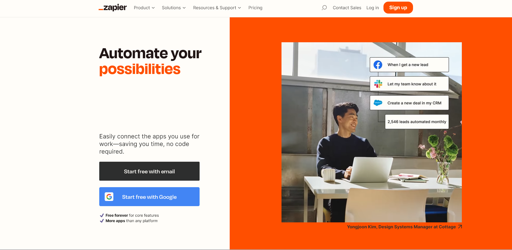
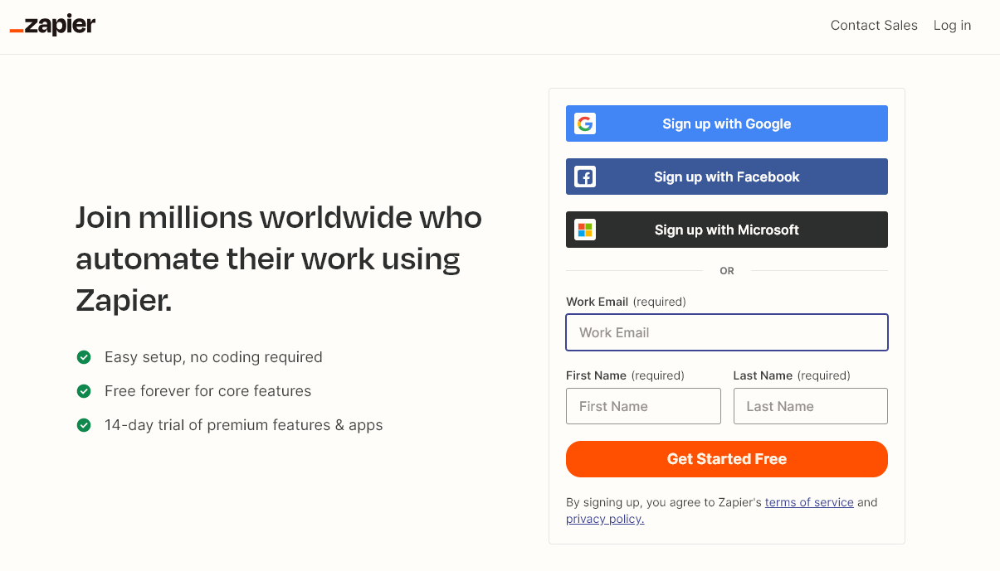
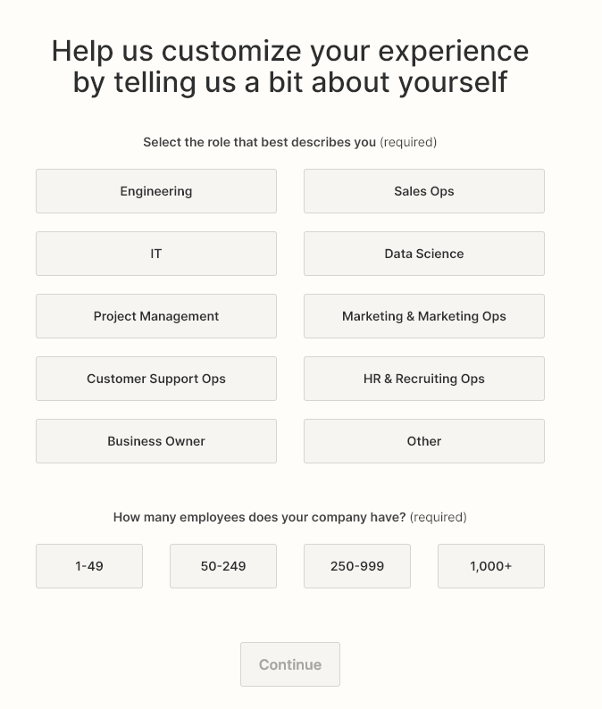
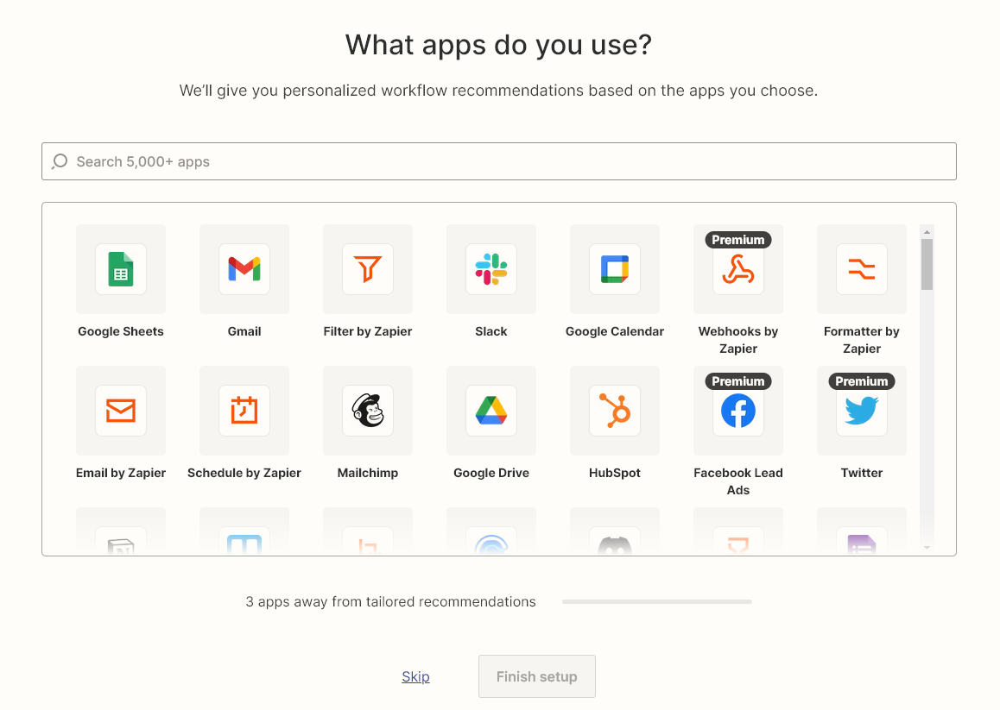
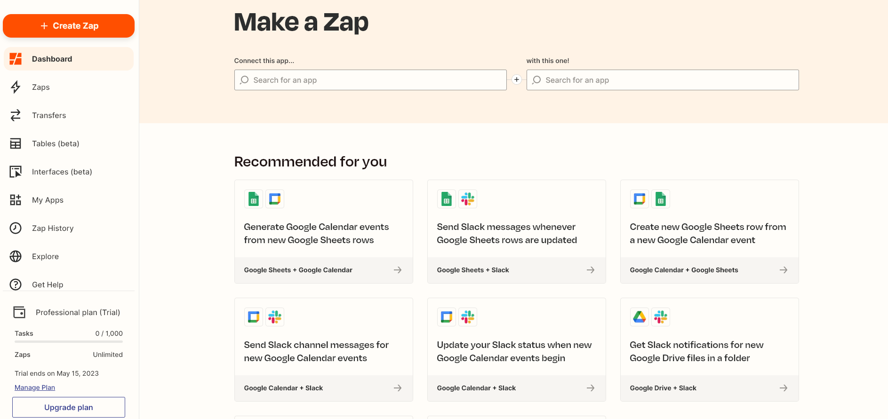
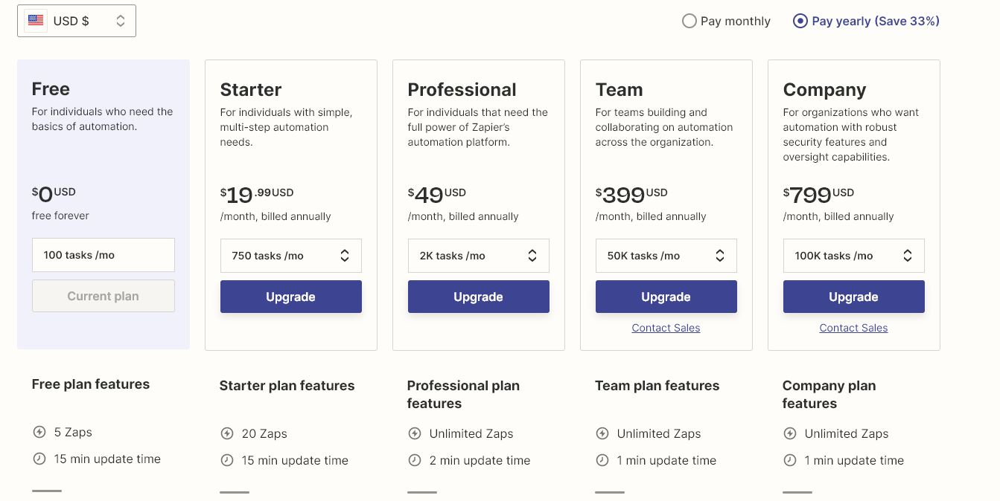

I've been a part of many cross-functional product-led growth teams throughout my journey as a BI Analyst at The Predictive Index. Our efforts while we re-built a legacy software as a PLG platform from scratch revolved around four areas: **signup flow, value metric clarity, product onboarding experience,** and **pricing model and transparency.**

My intention with these series is to try out as many PLG products as I can that offer a free version of their product. The end goal is to assess how each product fares in each of the five areas I mentioned. This will offer new perspectives for the product and revenue professionals in their own PLG journey.

## Zapier
Zapier allows users to connect web applications and automate workflows. The primary goal is automating dull tasks and save valuable time while reducing frustration. Zapier eliminates the  need to code for the end user to automate tasks. 
### Website messaging & signup flow (5/5)
Zapier's home page is simple. The "Zap orange" immediate hits you twice on the page. First, you see the elegant photography of a brand champion, which humanizes the brand. In the site's animated heading, the second orange demonstrates what you can automate. The rotation ever second adds a dynamic look to the brand. It also simple demonstrates many tasks you can do with Zapier. The Pricing page is conveniently placed on the navigation bar.

 

The free signup flow is as simple as it gets. On the left hand side, 3 bullet points tells you the following: (1) anybody can use Zapier, (2) core features are free forever, and (3) premium features are free for 14 days. The simple 3-field form asks for a work email, but Zapier also supports signing up with a provider such as Google or Microsoft. I was able to sign up with a Gmail account. Even though non-work emails typically having lower conversion rates from free to paid, allowing "freemail" signups is often a conscious decision by the marketing team to offer a more inclusive top-of-the-funnel approach.

 

Once you log in, Zapier asks about your role and your organization size to make better recommendations and collect persona data:

The next page boasts 5,000+ apps that Zapier features and you are prompted to choose at least 3 apps. This will do 2 things: Collect valuable data about app preferences and offer better recommendations that will lead the user to consume enough value metrics to qualify them as a lead.

 

### Feature and value metric clarity (3/5)
Once you log into Zapier, on the left hand side, you see the value metrics: You have 100 tasks and 5 zaps per month. These value metrics renew after each calendar month. By now, you already know what a "Zap" is. **Each zap is an automation.** But you don't seem to have visibility into what a "task" is before you log in.  [Zapier has a whole glossary of terms in the marketing website.](https://help.zapier.com/hc/en-us/articles/8496181725453-Learn-key-concepts-in-Zapier#task-0-9). **A task takes place each time a Zap runs.** For example, each time you get a notification on Slack that you have yet another meeting coming up in 10 minutes, that's an action. 

There was not a ton of transparency around this, unless you visited the Pricing page before signing up.  I'm not sure what is the norm for the % of free users to visit pricing pages before they sign up. It is my hypothesis that it's in the realm of 20-30%. 
 
### Product onboarding and Eureka moment (5/5)
During onboarding, you immediately see my favorite messaging in the product: **Make a Zap.** It's simple and intuitive. You have two simple fields that shows how you can connect an app to the other. The next step shows the trigger and the action that will take place once the first step triggers. The first value exchange takes place within minutes.

 

### Pricing model and transparency (4/5)
Zapier's pricing page is loaded with information. You see five tiers, all which you can try for free. The primary value metric seems to be **the number of tasks per month.** This was interesting to see because I assumed that Zaps were the primary value metric. 

Besides to tasks, the other feature limits seem to change by tier as well. There are many different value exchanges that vary by tier:
- Tasks
- Zaps
- Update time
- Single vs multi-step Zaps
- Premium apps
- Version history
- Integrations
- Personalized service
- Governance, and more.

The pricing page is as transparent as it gets. Each tier has their features laid out. Enterprise testimonial logos headline the page. The foreign currency option is a welcome addition. 

Zapier's pricing page brings a significantly high cognitive load to the user. I thought having five tiers was a bit of a reach. The primary persona(e) of the product seemed to be unclear or too vague. Differences between some tiers might lead to confusion. Monthly vs yearly payments offer added complexity. **All of this might lead the user to over-think and experience decision fatigue.**

### Verdict (17/20) 
Zapier is an amazing platform with a clear purpose, branding, and messaging. Some user education on the primary value metrics before signup might prove useful. The software is applicable almost anywhere, which makes it difficult to address a specific persona. But Zapier seems to ease this issue with transparent feature messaging.
