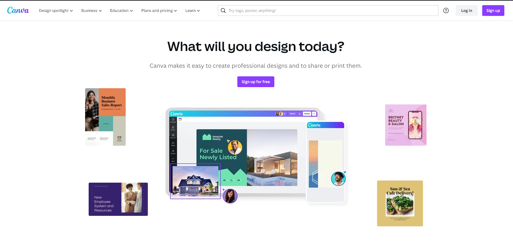
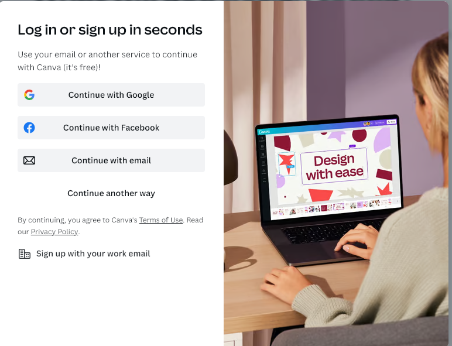
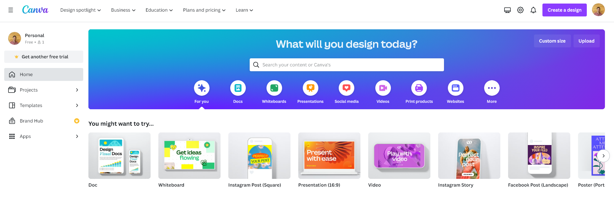
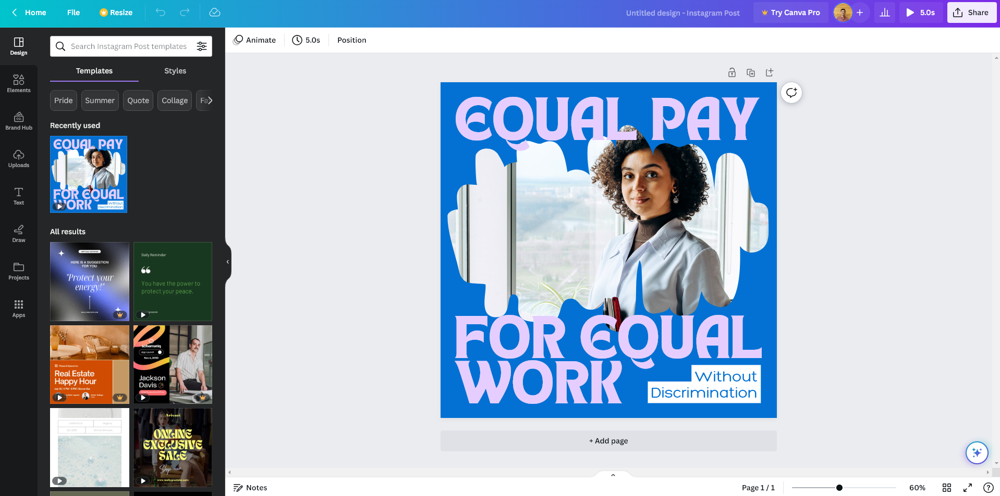

Looking for a tool that makes it simple to create stunning designs and effortlessly share or print them? This powerful design platform offers a user-friendly interface, access to a vast collection of community designs, and robust collaboration features, making it the go-to choice for professionals and beginners alike.

### Website messaging & signup flow (5/5)

Canva's homepage features a clean and minimalist design, with a dominant white background and the signature "Canva" purple accents. Upon landing on the page, you're immediately greeted with a pain probe and a clear value proposition. The primary call-to-action (CTA) above the fold is a straightforward *Sign up for free.* 

As you scroll down, you're presented with two compelling use cases: a realtor creating an impressive house design in minutes and a marketing professional crafting a captivating marketing proposal. What's particularly impressive about the homepage is that, once you start scrolling, you'll quickly come across Canva's three pricing plans, ensuring you have all the information you need right at your fingertips.

Canva marketing website has an amazing feature called "Play with Canva" where you can quickly play around with the product without even signing up.  Canva understands the importance of enabling users to experience the value of their platform as quickly as possible.

 

The signup flow encourages you to sign up with SSO, which will pay dividends in the future in the form of low friction to log in. The easier it is to log in, the more users log in, the more they realize value. Overall, the signup process was intuitive.

### Product onboarding and Eureka moment (5/5)
After signing up, you'll be prompted to search for community content, while the top right corner of the page encourages you to jump right in and start creating your own designs. 

The process of finding templates, styles, and design elements is incredibly intuitive—almost too easy. The true "eureka moment" occurs when you realize that you can effortlessly produce professionally designed graphics in just five minutes.

### Feature and value metric clarity (4/5)
Canva's website offers individual pages dedicated to each of its plans, providing complete transparency regarding their features and pricing. While it may be challenging to pinpoint a single value metric that distinguishes one plan from another, **Canva's free forever plan** offers an impressive range of benefits. With access to over 250,000 free templates, 100+ design types, and a library of more than 1 million free photos and graphics, the free plan delivers significant value. Although some of the premium content is restricted, the inclusion of 5GB of cloud storage makes Canva Free a compelling choice for users with basic design needs.

**Canva Pro** takes design to the next level with premium features such as Magic Resize, background manipulation tools, and AI-powered design capabilities. Additionally, this plan allows you to schedule your social media content across eight different platforms—an underrated feature that enhances your productivity and saves valuable time.

**Canva for Teams** stands out as a distinct offering, catering to collaborative work environments. In addition to the features provided by Canva Free and Canva Pro, Canva for Teams adds real-time collaboration, task assignments, and branded templates to the mix. The pricing for this plan is based on the size of your team, ensuring flexibility and scalability for organizations of all sizes.

### Pricing model and transparency (4/5)
Canva's pricing model is transparent and clearly displayed on each plan's dedicated page. While teams may need to do some calculations to determine the value of the additional features, Canva's playground feature allows you to explore both free and premium functionalities, providing a clear understanding of what to expect from each category. Canva also provides discounts for yearly upfront payments in all plans.

### Verdict (18/20)

With a clear value proposition and a focus on delivering immediate value to users, Canva excels in its promise to simplify design creation. The minimalist branding and seamless user experience enhance the overall appeal. The pricing structure is sensible and well-suited to various user needs. I am an advocate already.
