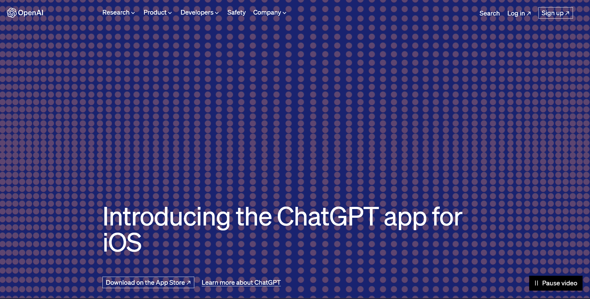
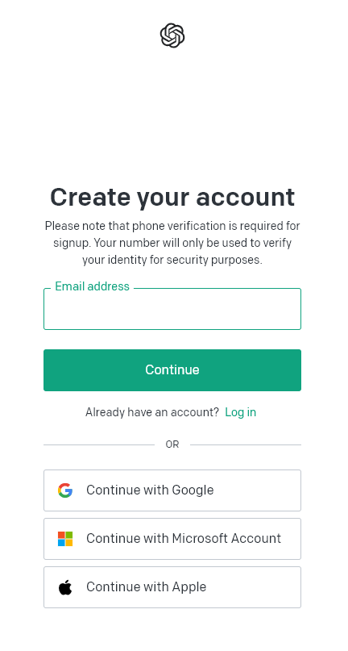
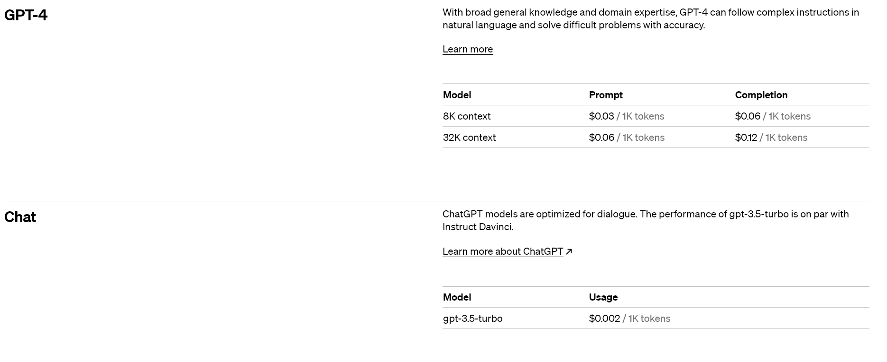

OpenAI promises to promote and develop friendly Artificial Intelligence tools. The added value of their products is the powerful large language model that is a trained model that "understands" and generates text like a human.

### Website Messaging & Signup Flow (4/5)

OpenAI needs no introduction, thanks to the [insane virality around its flagship product, ChatGPT.](https://www.reuters.com/technology/chatgpt-sets-record-fastest-growing-user-base-analyst-note-2023-02-01/) Above the fold is an engaging visual that captures attention. Signing up is a breeze, with options for Single Sign-On (SSO) and email address.

Once logged in, you'll be prompted to choose between ChatGPT, Dall-E (image and art generator), and API for applications.

### Product Onboarding and Eureka Moment (5/5)

The true eureka moment comes when you experience the immense power of ChatGPT during interactions. Imagine how businesses can leverage this power to enhance productivity, drive innovation, and boost profitability.

### Feature and Value Metric Clarity (4/5)

OpenAI's value metrics may seem complex, given the nature of their sophisticated products. The company operates with "tokens," which they define as "pieces of words, where 1,000 tokens is about 750 words." With ChatGPT, you'll be charged approximately \$0.002 per 1K tokens. In other words, generating as many words as found in this blog post will cost you around $0.001. Different models come with varying prices, but they all revolve around a single value metric: Tokens. I appreciate the clarity OpenAI provides in this regard. You also have the flexibility to set soft and hard limits, ensuring you stay within your preferred usage and budget.

### Pricing Model and Transparency (5/5)

OpenAI's pricing model is transparent and user-friendly. The only hurdle to overcome is understanding the concept of "tokens." To assist you, OpenAI offers a "usage tracking dashboard." This tool displays the number of tokens you've consumed during the current and previous billing cycles. 

Additionally, ChatGPT offers both a free plan and a plus plan. The plus plan comes with added benefits like enhanced responsiveness and speed, particularly during times of high demand. And demand for ChatGPT keeps growing.

### Verdict (18/20)

OpenAI delivers on its promise, providing high-quality AI solutions. One area for improvement could be simplifying the value metrics even further, such as using a straightforward pricing model like "$1 for 1000 words." This would greatly enhance user experience. Additionally, the purpose of the homepage animation could be made clearer. Nevertheless, these minor points are considered first-world problems.
