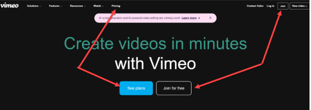
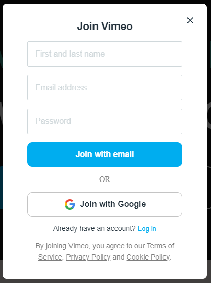
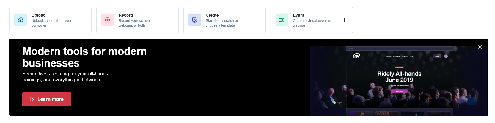
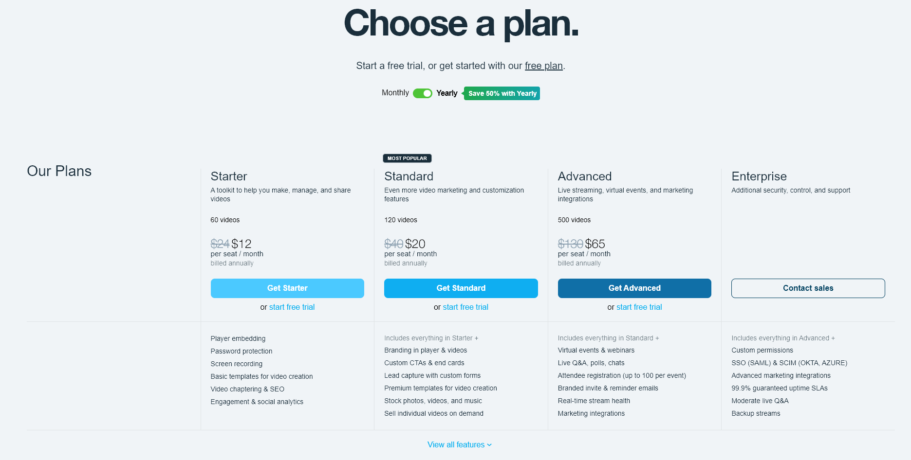

*This is a collaboration with Andrew Barks, the content Design Lead and UX Writer at The Predictive Index. Click [here](https://www.predictiveindex.com/blog/author/andrew-barks/) to catch up with Andrew's work or click [here](https://www.linkedin.com/in/andrew-barks-2758b077/) to connect with him!*

Vimeo, an all-in-one video platform, has embraced a product-led growth strategy that combines video hosting and sharing through a SaaS business model. In this blog post, we will explore how Vimeo's approach to product-led growth, as well as its freemium model and pricing, have made it a go-to platform for video enthusiasts and professionals alike.

### Website Messaging and Sign-up Flow (3/5)
Vimeo understands the importance of clear messaging and easy access to pricing information. By placing pricing above the fold, they eliminate a common frustration for site visitors: spending extra time searching for pricing details. This user-centric approach enhances transparency and enables potential customers to make informed decisions quickly. 

While some users may find the dual call-to-action (CTA) and the top-right "join" button redundant, Vimeo's intention is to provide multiple entrance points. This showcases their commitment to making the sign-up process as accessible as possible.

In another attempt to reduce friction, Vimeo opted for a simple sign-up flow that also features Google SSO. This way, users can quickly access the platform without needing to create a separate account. 

The form does not include any type of firmographic questionnaire, eliminating the hassle of filling out lengthy forms, and therefore increasing conversion rates. However, this approach may present challenges in collecting additional information about new users. Gathering such data is crucial for creating ideal customer profiles (ICPs) and personas, which can facilitate targeted marketing efforts in the future.

### Product Onboarding - and the Eureka! Moment (4/5)

Vimeo's product onboarding is designed to guide users seamlessly through the platform's key features. Upon signing up, users are presented with four clear actions:

* Upload
* Record
* Create videos 
* Host events

This intuitive layout ensures users can easily navigate the platform, and more crucially, get started with their video projects. 

It's worth noting, however, that the option to “upgrade” - enabling access to webinars and events - is only highlighted when users attempt to create such content. This could cause some initial confusion. Nevertheless, Vimeo's overall onboarding experience manages to lead users to their "Eureka! moment" – the realization that they have the tools at their disposal to produce high-quality videos with ease.

### Pricing and Value Metric Clarity (3/5)
Vimeo employs a transparent pricing model with tiered plans that cater to both individual users and businesses. First off, you have a “free forever” plan that ensures you can feature high- quality videos with no ads. This comes at the expense of very limited video making and editing tools, templates, and deeper user analytics. Under the free plan, users can upload or create up to two videos per month, with a maximum cap of 25 videos for the lifetime of the free account. Upon reaching this threshold, they must transition to a paid plan.

When it comes to the paid plans, Vimeo's pricing structure can be a bit intricate. 

While the limitations are based on the total number of videos, the payment is calculated on a per-seat basis. Furthermore, the inclusion of premium features varies significantly across plans, with the Standard and Enterprise plans offering a more extensive range of advanced functionalities compared to the Starter plan. 

The definition of "videos" and the extent of their inclusion may also cause some confusion for users seeking specific details. While the pricing page maintains a high level of transparency, the range of premium features introduces a lot of complexity and potential cognitive overload, [similar to that of Zapier’s.](/2023/05/01/product-on-trial-1-zapier/)

One concern worth noting is the high pricing, particularly as you progress to tiers like the Advanced plan, which might be typical for a mid-market company. The annual recurring revenue (ARR) of $15,600 for this plan may appear substantial when evaluating the value provided by the platform, specifically during periods of consistent cost-cutting measures around SaaS subscriptions.

### Verdict (3.3/5)
Vimeo has achieved remarkable success by quickly capturing a significant share of the expansive video user market. Their platform's user-friendly interface and the availability of a free forever option have solidified their reputation as a trusted choice for video creation and hosting.

The pricing and perceived value of Vimeo's paid plans could potentially be a drawback for companies seeking to procure a video platform vendor. Businesses may instead consider alternatives such as Loom or Wistia’s Soapbox, which offer comparable features, albeit with more limitations, at a significantly lower price point.

